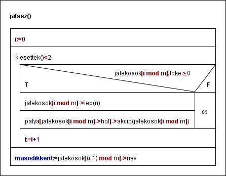
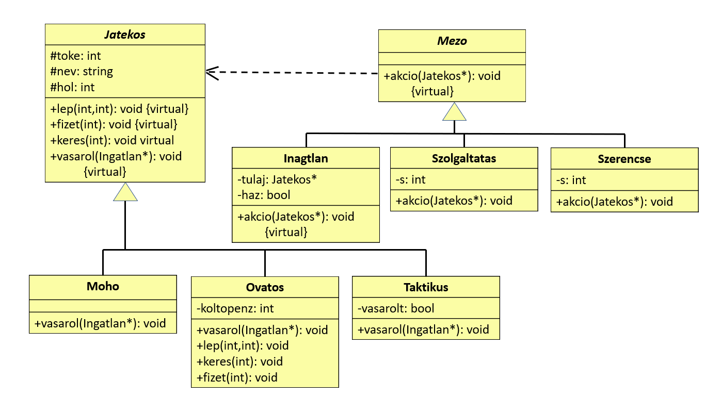

# Dokumentáció - Monopoly-szimuláció
## Feladat - egyetemi beadandó
Szimuláljuk az alábbi egyszerűsített Monopoly társasjátékot!  
Adott néhány eltérő stratégiájú játékos és egy körpálya, amelyen különféle mezők sorakoznak egymás után. A pályát körbe-körbe újra és újra bejárják a játékosok úgy, hogy egy kockával dobva mindig annyit lépnek, amennyit a kocka mutat. A mezők három félék lehetnek: ingatlanok, szolgáltatások és szerencse mezők. Az ingatlant meg lehet vásárolni 1000 Petákért, majd újra rálépve házat is lehet rá építeni 4000 Petákért. Ha ezután más játékos erre a mezőre lép, akkor a mező tulajdonosának fizet: ha még nincs rajta ház, akkor 500 Petákot, ha van rajta ház, akkor 2000 Petákot. A szolgáltatás mezőre lépve a banknak kell befizetni a mező paramétereként megadott összeget. A szerencse mezőre lépve a mező paramétereként megadott összegű pénzt kap a játékos. Háromféle stratégiájú játékos vesz részt a játékban.  
Kezdetben mindenki kap egy induló tőkét (10000 Peták), majd A „mohó” játékos ha egy még gazdátlan ingatlan mezőjére lépett, vagy övé az ingatlan, de még nincs rajta ház, továbbá van elég tőkéje, akkor vásárol. Az „óvatos” játékos egy körben csak a tőkéjének a felét vásárolja el, a „taktikus” játékos minden második vásárlási lehetőséget kihagyja. Ha egy játékosnak fizetnie kell, de nincs elégendő pénze, akkor kiesik a játékból, házai elvesznek, ingatlanjai megvásárolhatókká válnak.  
A játék paramétereit egy szövegfájlból olvassuk be. Ez megadja a pálya hosszát, majd a pálya egyes mezőit. Minden mezőről megadjuk annak típusát, illetve ha szolgáltatás vagy szerencse mező, akkor annak pénzdíját. Ezt követően a fájl megmutatja a játékosok számát, majd sorban minden játékos nevét és stratégiáját. A tesztelhetőséghez fel kell készíteni a megoldó programot olyan szövegfájl feldolgozására is, amely előre rögzített módon tartalmazza a kockadobások eredményét.  
Írjuk ki melyik játékos esik ki másodszorra a játékból!

## Specifikáció
A pálya mezőinek leírásához bevezetük négy osztályt, az absztrakt Mezo osztályt és leszármazottjait, a Szerencse-t, Szolgaltatast-t és Ingatlan-t. A mezőknek nincs közös tulajdonsága, így a Mezo ősosztálynak csak egy tisztán virtuális akcio(Jatekos* x) metódusa lesz. Ez játszódik le, mikor egy játékos rálép. A Szerencse illetve Szolgaltatas osztályok adattagja egy egész szám (s), a fizetendő/keresett összeg. Az Ingatlan osztálynak két adattagja van, a tulaj (Jatekos*) és a haz (logikai). Az akcio metódus definiálásában pedig lehetséges vásárlás esetén meghívja a Jatekos (tisztán virtuális) vasarol(Ingatlan*) metódusát.  
A játékosokhoz is bevezetünk egy ősosztályt, a Jatekos-t toke, nev és hol (pozíció a pályán) adattagokkal. Virtuális metódusai a fizet, keres, lep és vasarol(tisztán virtuális). Leszármazottjai a Moho, az Ovatos és a Taktikus. Az Ovatosnak adattagja a koltopenz (tőkéjének fele – a körben elköltött pénz), a vasarol metóduson kívül felülírja a keres (koltopenz nő) és a lep (új körnél koltopenz beállítása) metódusokat is. A Taktikus adattagja a vasarolt logikai változó, ami a minden második vásárlást biztosítja.  
Az akcio(Jatekos*) és a vasarol(Mezo*) metódus megfelelő definiálása (feladat alapján):
<table>
  <tr><th>Szerencse</th></tr>
  <tr><td>Jatekos +s</td></tr>
</table>

<table>
  <tr><th>Szolgaltatas</th></tr>
  <tr><td>Jatekos -s</td></tr>
</table>

<table>
  <tr><th colspan=5>Ingatlan</th></tr>
  <tr>
    <th colspan=2>Más tulaj</th>
    <th colspan=3>Saját / Nincs tulaj</th>
  </tr>
  <tr>
    <th>Nincs ház</th>
    <th>Van ház</th>
    <th>Moho</th>
    <th>Ovatos</th>
    <th>Taktikus</th>
  </tr>
  <tr>
    <td>Jatekos -500</td>
    <td>Jatekos -2000</td>
    <td colspan=3 rowspan=2 align="center">lent</td>
  </tr>
  <tr>
    <td>tulaj +500 (ha a tulaj nem esett ki)</td>
    <td>tulaj +2000 (ha a tulaj nem esett ki)</td>
  </tr>
</table>

<table>
  <tr>
    <th></th>
    <th>Moho</th>
    <th colspan=2>Ovatos</th>
    <th colspan=2>Taktikus</th>
  </tr>
  <tr>
    <th rowspan=2>Nincs tulaj, van tőke</th>
    <td rowspan=2>megvesz</td>
    <th> Van költőpénz</th>
    <td>megvesz</td>
    <th>Nem vásárolt</th>
    <td>megvesz, vasarolt:=igaz</td>
  </tr>
  <tr>
    <th>Nincs költőpénz</th>
    <td>-</td>
    <th>Vásárolt</th>
    <td>vasarolt:=hamis</td>
  </tr>
  <tr>
    <th rowspan=2>Saját, nincs ház, van tőke</th>
    <td rowspan=2>épít</td>
    <th>Van költőpénz</th>
    <td>épít</td>
    <th>Nem vásárolt</th>
    <td>épít, vasarolt:=igaz</td>
  </tr>
  <tr>
    <th>Ninc költőpénz</th>
    <td>-</td>
    <th>Vásárolt</th>
    <td>vasarolt:=hamis</td>
  </tr>
</table>
Az Ingatlan akcio-jának vásárlási lehetőséges része függ a Jatekos típusától. Itt elágazás helyett meghívja a Jatekos tisztán virtuális vasarol(Ingatlan*) függvényét.

A specifikációban szükség lesz a jatekosok és palya különböző változataira, mivel azok állapota minden lépés után megváltozhat. (A programban egyszerre csak az egyik állapot fog szerepelni.) Egy játékos lépését a *lépakció*: jatekos x jatekosok x palya -> jatekosok x palya függvénnyel jelöljük. Kisesett játékos esetén az az identitásfüggvény. A jatekosok ill. palya i-edik állapotát jatekosoki-vel ill. palyai-vel jelöljük.

Állapottér:   jatekosok: Jatekosm, palya: Mezon, masodikkent: string  
Előfeltétel:	jatekosok=jatekosok’ ∧ palya=palya’  
Utófeltétel:	∀i∈N+: jatekosoki, palyai = lepakcio(jatekosoki-1[i mod m],jatekosoki-1,palyai-1)
∧ masodikkent=jatekosoki[j].nev, ahol i-re: ( jatekosoki[j].toke<0 ∧ ∃! k∈[0,m] : k≠j ∧ jatekosoki-1[k].toke<0 )

Algoritmus: (beolvasott kockadobásokra való felkészítés nélkül)
(a kiesettek() függvény megszámolja a jatekosok tömbben a kiesetteket /toke<0/ )

## Terv

